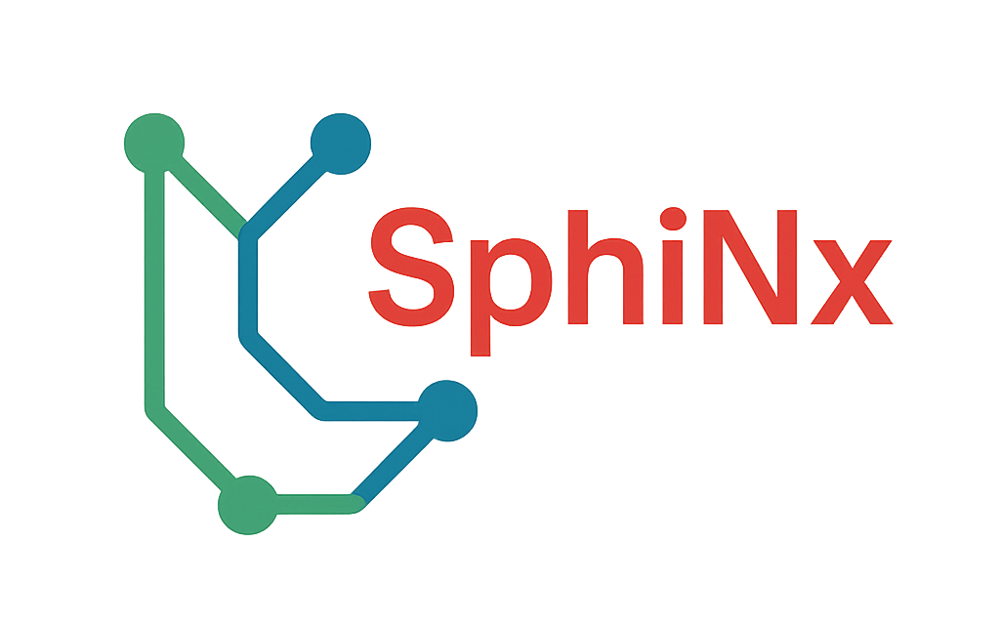

 

This is the entry point for Project "SphiNx" (In german: "[Sp]rachmodelle im [h]ybriden [i]ndustriellen [N]utzungskonte[x]t). 

# Objectives
This project investigates the use of large language models in industrial settings, focusing on preserving and sharing expert knowledge while helping integrate lower-skilled workers and non-native speakers. The main technical challenges are largely solved; the harder problems are data protection, liability, and user acceptance. The project addresses these socio-technical issues and aims to deliver an AI chatbot demonstrator that provides expert knowledge in a way that is privacy-compliant, legally sound, and accessible (in language and complexity). Project results will largely be released as open source to benefit small and medium-sized enterprises.

# Associated Repositories
- [cc-harness](https://github.com/please-insert-name/cc-harness)
Content Creator Harness: A skill set for knowledge management and efficient AI co-working for content creation and conceptional work.

# Disclaimer
This project is supported by "Bavarian Transformation and Research Foundation", Grant AZ-1648-24 ("SphiNx: Sprachmodelle im hybriden industriellen Nutzungskontext")

